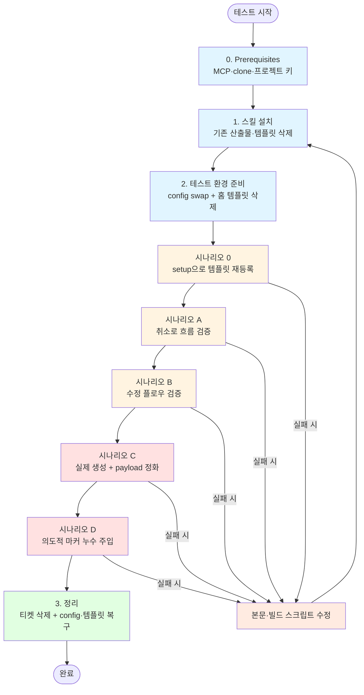
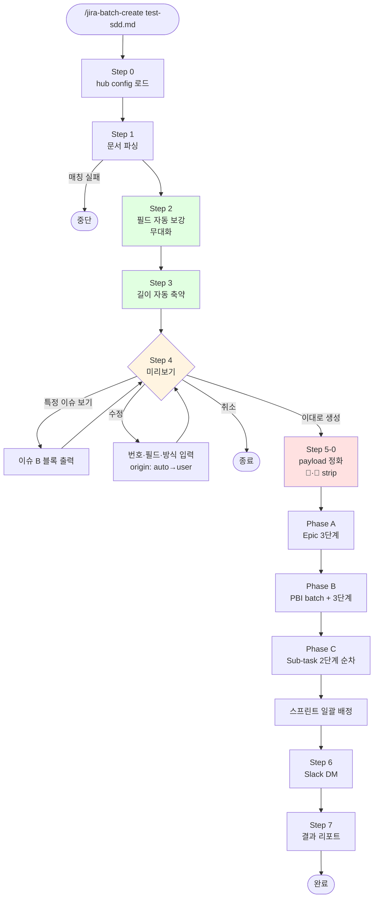

# jira-batch-create 재설계 테스트 워크플로우

**대상 브랜치**: `refactor/jira-batch-create-auto-first`
**목적**: 재설계된 스킬이 "사람 개입 최소 + 자동 보강 + 🤖/👤 마커 누수 없음"을 만족하는지 검증

---

## 0. Prerequisites

- **Claude Code CLI** 설치됨
- **MCP 서버 등록 완료** — `mcp-atlassian`, `slack`
- **저장소 경로**: `/Users/psh/develop/atlassian-skills`
- **테스트 Jira 프로젝트**: **JST** (14개 이슈 생성·삭제 가능해야 함)
- **홈 config 부재 시**: `/jira-create-setup` 스킬로 먼저 `~/.claude/sprint-workflow-config.md` 생성

---

## 전체 워크플로우 도식



## 스킬 내부 실행 흐름 도식 (재설계 후)



**범례**: 녹색 = 무대화(자동), 노랑 = 사용자 개입, 빨강 = 데이터 정화·외부 API 호출.

---

## 1. 스킬 설치

### 1-1. 브랜치 체크아웃

```bash
cd /Users/psh/develop/atlassian-skills
git fetch origin
git checkout refactor/jira-batch-create-auto-first
```

### 1-2. 기존 배포 산출물 · 프로젝트 로컬 템플릿 제거

```bash
rm -rf .claude/commands/* .agents/skills/*
rm -f .claude/jira-sdd-templates.yml
```

- 빌드 산출물(`.claude/commands/*`, `.agents/skills/*`): 재빌드로 새로 생성됨
- 프로젝트 로컬 템플릿(`.claude/jira-sdd-templates.yml`): 삭제 후 **시나리오 0에서 setup 스킬로 재등록**해 전체 파이프라인(setup → batch-create) 검증
- **보존 대상**: `.claude/settings.local.json`(Claude Code 설정), `.claude/sprint-workflow-config.md`(config swap 소스) — 건드리지 않는다

### 1-3. project scope 빌드 & 배포

```bash
bash scripts/build-skills.sh --scope project --project-dir /Users/psh/develop/atlassian-skills
```

기대 출력:
```
[build-skills] Building 6 skill(s) | target=all scope=project
[claude] confluence-fetch -> ...
[codex ] confluence-fetch -> ...
... (12개)
[build-skills] Done. 12 file(s) deployed.
```

### 1-4. 치환 누수 검증

```bash
grep -l "{{CONFIG" .claude/commands/*.md .agents/skills/*/SKILL.md 2>&1 || echo "치환 누수 없음"
```

→ **"치환 누수 없음"** 출력되면 통과.

### 1-5. Claude Code 세션 재시작

project scope 스킬은 세션 시작 시 로드되므로, 새 세션을 열거나 현재 세션에서 스킬 목록을 새로 인식할 수 있도록 Claude Code를 재시작한다.

스킬 목록에서 아래 두 개가 **project** 소스로 나타나는지 확인:
- `jira-batch-create`
- `jira-batch-create-setup`

---

## 2. 테스트 환경 준비

스킬의 CONFIG_PATH는 홈 경로(`~/.claude/sprint-workflow-config.md`)로 치환되므로, JST 프로젝트로 테스트하려면 홈 config를 일시적으로 JST용으로 바꾼다.

**템플릿(`~/.claude/jira-sdd-templates.yml`)은 단순 swap이 아니라 삭제**한다. 이후 시나리오 0에서 `/jira-batch-create-setup`으로 새로 등록해 setup 스킬까지 파이프라인 전체를 검증한다.

**전제**: 템플릿(`~/.claude/jira-sdd-templates.yml`)은 **없는 상태에서 시작**한다. 시나리오 0의 `/jira-batch-create-setup`이 생성 흐름 자체를 검증한다. 파일이 이미 있다면 **삭제 후 시작**한다(재생성되므로 내용 손실 없음).

### 2-1. config 백업 (파일이 있을 때만)

```bash
TS=$(date +%Y%m%d-%H%M%S)
[ -f ~/.claude/sprint-workflow-config.md ] \
  && cp ~/.claude/sprint-workflow-config.md ~/.claude/sprint-workflow-config.md.bak-$TS \
  && echo "✅ config 백업: $TS" \
  || echo "(홈 config 없음 — 백업 스킵. Prerequisites에서 먼저 생성했어야 함)"
```

> 백업 타임스탬프를 메모해두면 복구 시 편하다. 템플릿은 어차피 시나리오 0에서 재생성하므로 백업하지 않는다.

### 2-2. config swap + 템플릿 초기화

홈 config가 이미 JST로 설정돼 있다면 swap 생략. 프로젝트 로컬 config로 테스트하는 경우에만 swap:

```bash
cp .claude/sprint-workflow-config.md ~/.claude/sprint-workflow-config.md   # (선택) JST로 swap
rm -f ~/.claude/jira-sdd-templates.yml                                      # 시나리오 0이 새로 만든다
```

### 2-3. 활성 환경 확인

```bash
grep "프로젝트 키\|보드 ID" ~/.claude/sprint-workflow-config.md
test ! -f ~/.claude/jira-sdd-templates.yml && echo "✅ 홈 템플릿 없음 — 시나리오 0에서 생성"
```

→ 기대값:
```
프로젝트 키: JST
보드 ID: 2155
✅ 홈 템플릿 없음 — 시나리오 0에서 생성
```

---

## 사전 상태 체크리스트

- [ ] 브랜치: `refactor/jira-batch-create-auto-first` 체크아웃
- [ ] 배포: project scope (`.claude/commands/`, `.agents/skills/`) 12개 파일
- [ ] 치환 누수: `{{CONFIG_*}}` 리터럴 0건
- [ ] 활성 config: JST (보드 2155)
- [ ] 활성 템플릿: **없음** (삭제된 상태, 시나리오 0에서 등록)
- [ ] Claude Code 세션 재시작 후 스킬 목록에 batch-create / batch-create-setup 인식
- [ ] JST 프로젝트에 test-sdd.md로 만들어진 기존 티켓 0건

---

## 시나리오 0 — setup 스킬로 템플릿 등록

템플릿이 없는 상태에서 `/jira-batch-create`가 **중단 메시지**를 내는지, 그리고 `/jira-batch-create-setup`으로 신버전 템플릿이 정상 등록되는지 확인한다.

> **이 시나리오는 본 브랜치의 치명적 회귀 테스트**다. 이전 빌드는 `{{CONFIG_DIR}}` 토큰이 치환되지 않아 setup이 저장 시 리터럴 경로에 쓰려다 실패했다. 이 브랜치의 빌드 스크립트 수정 이후에야 `~/.claude/jira-sdd-templates.yml` 경로에 정상 저장된다. 7번 체크(파일 실제 생성 확인)가 이를 검증한다.

1. [ ] **가드 확인**: `/jira-batch-create test-sdd.md` 실행
   - [ ] "SDD 템플릿이 등록되어 있지 않습니다. `/jira-batch-create-setup`을 먼저 실행하세요." 메시지 출력 후 중단
2. [ ] `/jira-batch-create-setup` 실행
3. [ ] 기존 템플릿 확인 단계:
   - [ ] "등록된 템플릿이 없습니다" 또는 비어있는 목록 표시 → "새 템플릿 추가" 경로
4. [ ] 템플릿 이름 입력 → `spec-kit`
5. [ ] 샘플 SDD 경로 입력 → `test-sdd.md`
6. [ ] 파싱 규칙 초안 확인:
   - [ ] **식별 패턴**: `# Tasks:`
   - [ ] **Epic**: H1
   - [ ] **Story**: H2 + "User Story" 포함
   - [ ] **Sub-task 태그**: `[US*]` (Story 하위) + **`[T*]` (Task 하위)** ← 신버전 핵심
   - [ ] **메타데이터**: 목적 / 목표 / 독립 테스트 / 파일 경로 마커 감지
7. [ ] "저장" 선택 → `~/.claude/jira-sdd-templates.yml` 파일 생성 확인
   ```bash
   cat ~/.claude/jira-sdd-templates.yml
   ```
   - [ ] `templates:` 루트 + `spec-kit:` 항목 존재
   - [ ] `tasks.subtask.tags`가 배열 형식(`pattern`/`parent` 두 세트)
8. [ ] 완료 메시지 출력

**실패 시그널**:
- 템플릿이 `tag` 단수 형태로 저장됨 → 구버전으로 저장되는 버그(본문 수정 필요)
- `[T*]` 태그가 초안에 감지되지 않음 → setup 파싱 로직 오류

---

## 시나리오 A — 기본 흐름 (취소로 안전 검증)

실제 티켓은 만들지 않고, Step 1~4 흐름과 미리보기 품질만 본다.

1. [ ] 새 세션에서 `/jira-batch-create test-sdd.md` 실행
2. [ ] **Step 1~3 질문 없이 자동 진행** 확인 (파싱·자동 보강·길이 검증)
3. [ ] **Step 4 미리보기** 확인:
   - [ ] 계층 요약 테이블에 14개 이슈 나오는가
   - [ ] "상위" 컬럼과 `↳`/`↳↳` 접두어가 계층을 정확히 표현하는가
   - [ ] SP 컬럼에 Sub-task는 `-`, PBI만 숫자가 들어오는가
   - [ ] 8pt PBI가 있으면 하단 경고 1줄이 뜨는가 (없으면 경고 생략)
   - [ ] 이슈가 14개(>5)라서 **"🤖 자동 생성 전략 요약" 블록**이 나오고 전문은 펼쳐지지 않는가
   - [ ] 확인 질문에 **"특정 이슈 보기" 선택지가 포함**되는가 (4지 선택)
4. [ ] "특정 이슈 보기" 선택 → 번호 `7` 입력 → 해당 이슈 전문 출력
   - [ ] 📌 **마커 확인**: AC·증거·"제외"에 🤖가 붙고, 문서 원문 목적/파일 경로에는 마커 없음
5. [ ] "특정 이슈 보기" → 번호 `2` 입력 → Task의 전문 확인
6. [ ] 확인 질문에서 **"취소"** 선택 → 종료
7. [ ] 검증: JST에 새 티켓이 생성되지 않았는지 Jira에서 확인

**실패 시그널**:
- 질문이 Step 1~3에서 뜬다 → 자동 보강 규칙이 작동 안 함
- 🤖 마커가 문서 원문에도 붙는다 → origin 메타 분류 오류
- 전문 블록이 14개 전부 펼쳐진다 → 출력 분량 규칙이 `> 5` 분기를 안 탐

---

## 시나리오 B — 수정 플로우 (👤 마커 검증)

실제 티켓 생성 전에 수정 기능을 점검한다.

1. [ ] `/jira-batch-create test-sdd.md` 재실행 (또는 시나리오 A에서 계속)
2. [ ] Step 4 확인 질문에서 **"수정"** 선택
3. [ ] 번호 `7` 입력 (Google 로그인 Story)
4. [ ] 전문 블록에서 AC가 🤖로 표시되는지 확인
5. [ ] 필드 선택: **"AC"** 다중 선택
6. [ ] AC 수정 방식 → **"더 구체적으로"** 선택
7. [ ] 재생성된 AC 확인:
   - [ ] 마커가 🤖 → **👤** 로 바뀌는가
   - [ ] 내용이 원본보다 구체적인가
8. [ ] 요약 테이블이 재출력되고, 해당 이슈 행 변경 여부가 표시되는가
9. [ ] 다시 "수정" → 번호 `2` → **"증거"** → **"직접 작성"** → 새 값 입력
   - [ ] 👤 마커로 갱신되는가
10. [ ] 확인 질문에서 **"취소"**로 안전 종료

**실패 시그널**:
- 수정 후에도 🤖가 남아있다 → origin `user` 갱신 누락
- 수정 반영이 안 됨 → 상태 관리 오류

---

## 시나리오 C — 실제 생성 + payload 정화 검증

**주의: JST 프로젝트에 실제로 14개 티켓이 만들어짐. 테스트 후 다시 삭제 필요.**

1. [ ] `/jira-batch-create test-sdd.md` 실행
2. [ ] Step 4에서 **아무 필드도 수정하지 않고** 바로 "이대로 생성" 선택
   - (모든 필드가 `auto`인 최악 케이스에서 마커 누수를 보기 위함)
3. [ ] Step 5 Phase A → B → C 순차 실행 관찰
   - [ ] Epic 1개 생성 (Phase A)
   - [ ] PBI 5개 batch 생성 + 후처리 3단계 체인 (Phase B)
   - [ ] Sub-task 8개 개별 생성 + 2단계 체인 (Phase C)
4. [ ] Step 6 Slack DM 수신 확인
   - [ ] 14개 이슈 모두 링크 포함
   - [ ] Jira 도메인이 `tmaxsoft.atlassian.net/browse/JST-xx`로 조립됨
5. [ ] Step 7 결과 리포트 출력
6. [ ] **🤖/👤 마커 누수 회귀 테스트** (핵심):
   - [ ] JST Epic 1건과 Story 1건을 Jira 웹에서 열어 description/AC/증거 필드를 확인
   - [ ] `jira_get_issue`로 원시 필드값 조회 후 🤖/👤 grep
   - [ ] 결과가 **0건**이어야 통과

**실패 시그널**:
- Jira 필드에 🤖/👤가 한 글자라도 남아있다 → Step 5-0 payload 정화 누락
- Slack 메시지 링크가 `browse/` 누락 또는 도메인 하드코딩 → URL 조립 로직 오류
- Phase B에서 description이 빈 템플릿으로 덮임 → 자동화 룰 우회 3단계 순서 위반

---

## 시나리오 D — 수정 + 생성 복합 (👤 → Jira 검증)

시나리오 C의 연장. 수정한 값이 Jira에 마커 없이 저장되는지 본다.

1. [ ] 시나리오 C의 티켓들을 전부 삭제 (또는 이 시나리오만 독립 실행)
2. [ ] `/jira-batch-create test-sdd.md`
3. [ ] Step 4에서 "수정" → 번호 `7` → AC "직접 작성"으로 이모지를 **일부러 포함해서** 입력:
   ```
   1. 🤖 Google 로그인 플로우 완료 (의도적 누수 테스트)
   ```
4. [ ] 👤 마커가 붙는지 확인 후 "이대로 생성"
5. [ ] 생성된 JST-XX의 AC 필드 확인:
   - [ ] 사용자가 직접 넣은 🤖 문자가 **strip되어 사라짐**
   - [ ] Step 7 리포트 하단에 `⚠️ 렌더링 마커 누수 N건 감지 — 자동 strip됨` 경고 출력

---

## 3. 테스트 종료 후 정리

### 3-1. 생성된 테스트 티켓 삭제 (시나리오 C·D 수행한 경우)

Claude에게 다음 요청:
> "JST 프로젝트에서 오늘 생성된 test-sdd 관련 티켓 전부 삭제해줘"

### 3-2. 글로벌 config 복구 (백업 파일이 있을 때만)

2-1에서 기록한 타임스탬프로 복원. 백업이 없거나 swap을 하지 않았다면 스킵:

```bash
TS=<기록한 타임스탬프>
[ -f ~/.claude/sprint-workflow-config.md.bak-$TS ] \
  && cp ~/.claude/sprint-workflow-config.md.bak-$TS ~/.claude/sprint-workflow-config.md \
  && echo "✅ config 복구" \
  || echo "(config 백업 없음 — 2-2에서 swap하지 않았다면 정상)"
```

### 3-3. 템플릿 처리 (선택)

시나리오 0에서 `/jira-batch-create-setup`이 만든 `~/.claude/jira-sdd-templates.yml`을 유지할지 삭제할지는 상황에 따라:

- **유지**: 다음 테스트 시 시나리오 0의 "기존 템플릿 존재" 분기를 검증하거나, 일반 사용을 이어갈 경우
- **삭제**: 완전히 깨끗한 상태를 원할 경우
  ```bash
  rm -f ~/.claude/jira-sdd-templates.yml
  ```

### 3-4. 복구 확인

```bash
grep "프로젝트 키" ~/.claude/sprint-workflow-config.md
# → 원래 글로벌 config의 프로젝트 키(TCI 등)가 나오면 정상
#   (swap하지 않았다면 JST 그대로 — 이 경우도 정상)
```

### 3-5. 백업 파일 정리 (선택)

```bash
rm -f ~/.claude/sprint-workflow-config.md.bak-*
```

---

## 최종 판정 기준

| 항목 | 통과 조건 |
|------|----------|
| 질문 횟수 | Step 4 미리보기 1회 (+ 수정/특정 이슈 보기 선택 시만 추가) |
| 계층 렌더링 | 요약 테이블에 14개, `↳`/`↳↳` 접두어로 계층 표현 |
| 마커 표시 | auto=🤖, user=👤, doc=마커 없음 — 각자 정확 |
| 출력 분량 | >5개 입력 시 자동 생성 전략 요약만 기본 출력 |
| payload 정화 | JST 이슈 필드에 🤖/👤 0건 |
| Phase 순서 | A → B(3단계) → C(2단계) → 스프린트 배정 |
| Slack 링크 | `{Jira 도메인}/browse/{KEY}` 형식 14개 |

모두 통과하면 main 머지 준비 완료.
통과 못 하면 실패 시그널 참고하여 본문/빌드 스크립트 수정 후 1-3 재빌드.
