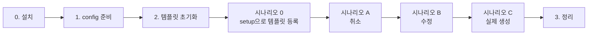

# jira-batch-create 테스트 워크플로우

대상 브랜치: `refactor/jira-batch-create-auto-first`
목적: 자동 보강 + 미리보기 + payload 정화 + P0 fix 3건 회귀 검증

---

## 흐름



---

## Prerequisites

- Claude Code · MCP(`mcp-atlassian`, `slack`) 설치 완료
- 저장소 위치: `/Users/psh/develop/atlassian-skills`
- 테스트 프로젝트: 본인 샌드박스 (이 문서는 `JST` 기준)

---

## 0. 설치

```bash
cd /Users/psh/develop/atlassian-skills
git checkout refactor/jira-batch-create-auto-first
rm -rf .claude/commands/* .agents/skills/*
bash scripts/build-skills.sh --scope project --project-dir .
```

---

## 1. config 준비

홈 config(`~/.claude/sprint-workflow-config.md`)의 **프로젝트 키가 본인 샌드박스와 같은지** 확인.

```bash
grep "프로젝트 키" ~/.claude/sprint-workflow-config.md
```

### 다를 때 — 세 가지 방법 중 하나

**A. Claude에게 요청**: "홈 config 프로젝트 키를 JST로 바꿔줘" — 내가 프로젝트 키·보드 ID·필드 ID를 한번에 교체.

**B. `/jira-create-setup` 실행**: setup 스킬로 재설정.

**C. 직접 편집**: `~/.claude/sprint-workflow-config.md`를 에디터로 열어 `## Jira` 섹션 값 교체.
```
프로젝트 키: JST
보드 ID: 2155
스토리 포인트 필드: customfield_10016
AC 필드: customfield_12881
증거 필드: customfield_12880
```

---

## 2. 템플릿 초기화

시나리오 0에서 setup이 새로 만들도록 먼저 비운다.

```bash
rm -f ~/.claude/jira-sdd-templates.yml
```

---

## 시나리오 0 — setup으로 템플릿 등록

1. `/jira-batch-create test-sdd.md` → "템플릿 없음" 가드 확인
2. `/jira-batch-create-setup` → 이름 `spec-kit`, 샘플 `test-sdd.md`
3. 초안에 `[US*]`와 **`[T*]`** 둘 다 감지 확인 → 저장
4. `cat ~/.claude/jira-sdd-templates.yml` → `tags` 배열 형식 확인

---

## 시나리오 A — 취소 (안전)

1. `/jira-batch-create test-sdd.md`
2. Step 1~3 질문 없이 자동 진행 확인
3. Step 4 미리보기 출력 (요약 테이블 + 자동 생성 전략 요약)
4. "특정 이슈 보기" → 번호 입력 → 🤖 마커 확인
5. "취소" 선택

**검증 포인트**: P0-1(assignee) / P0-2(이슈 타입 맵)가 에러 없이 통과

---

## 시나리오 B — 수정 플로우 (안전)

1. Step 4에서 "수정" → 번호 → AC "더 구체적으로"
2. 🤖 → 👤 마커 전환 확인
3. "취소"로 종료

---

## 시나리오 C — 실제 생성 (⚠️ 티켓 생성됨)

1. `/jira-batch-create test-sdd.md`
2. Step 4에서 "이대로 생성"
3. Phase A/B/C 순차 실행 관찰 (14건 생성)
4. Slack DM 수신 확인

**검증 포인트**:
- P0-3: Phase C Sub-task가 **3단계 호출**로 생성되고 ADF 오류 0건
- 마커 누수: Jira 이슈 description·AC·증거에 🤖/👤 0건
  → Claude에게 "생성된 이슈 중 JST-XX 필드에 🤖/👤 있는지 확인해줘"

---

## 시나리오 D — 의도적 마커 strip 검증 (선택, ⚠️ 티켓 생성됨)

1. Step 4에서 "수정" → AC에 `🤖 테스트` 직접 입력
2. "이대로 생성"
3. 생성된 Jira 이슈 AC 필드에 🤖 **사라졌는지** 확인
4. Step 7 리포트에 "⚠️ 렌더링 마커 누수 N건 감지 — 자동 strip됨" 경고 출력

---

## 3. 정리

- Claude에게 요청: "JST에서 오늘 생성된 test-sdd 관련 티켓 전부 삭제해줘"
- config를 원래대로 되돌려야 하면 Claude에게 "홈 config를 TCI로 되돌려줘" 요청

---

## 판정

| 결과 | 다음 |
|------|------|
| 시나리오 C에서 14건 정상 생성 + 마커 0건 | main `--no-ff` 머지 |
| 일부 실패 | 실패 로그 공유 → fix 추가 |
| 새 이슈 발견 | `post-test-findings.md`에 기록 |
