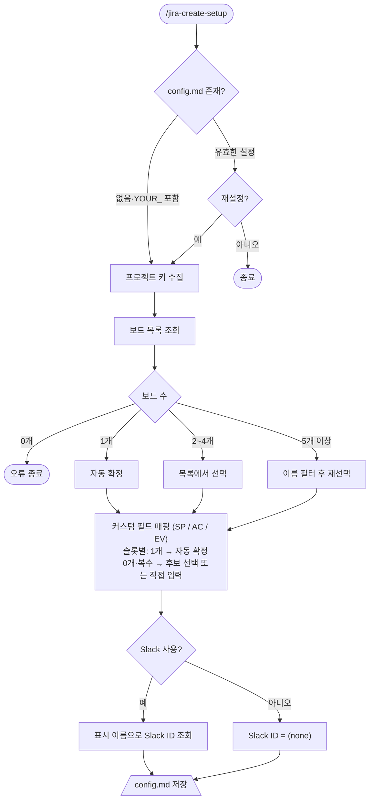
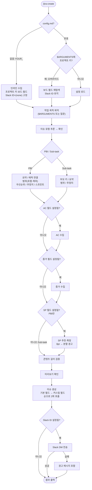
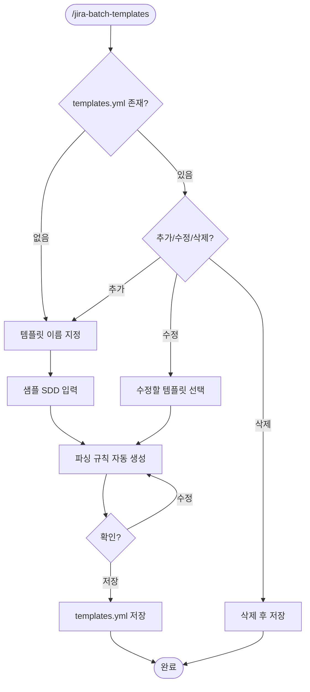

# jira-create 스킬

Jira 이슈를 AI 에이전트 대화 형식으로 생성하는 스킬이다. Claude Code와 Codex 양 환경을 지원한다.
Story (스토리) / Task (작업) / Bug (버그) / Spike (스파이크) / Sub-task (하위 작업)를 지원하며, 생성 후 Slack DM으로 알림을 전송한다.

---

## 목차

- [포함 파일](#포함-파일)
- [플로우](#플로우)
- [사전 준비](#사전-준비)
- [설치](#설치)
- [워크플로우](#워크플로우)
  - [프로젝트 설정](#프로젝트-설정)
  - [이슈 생성](#이슈-생성)
  - [SDD 템플릿 시스템](#sdd-템플릿-시스템)
  - [일괄 생성](#일괄-생성)
- [특정 이슈만 다른 프로젝트로 생성할 때](#특정-이슈만-다른-프로젝트로-생성할-때)
- [고도화 로드맵](#고도화-로드맵)

---

## 포함 파일

| 파일 | 커맨드 | 용도 |
|------|--------|------|
| `jira-create-setup.md` | `/jira-create-setup` | 프로젝트 설정 (초기 및 재설정) |
| `jira-create.md` | `/jira-create` | 이슈 생성 |
| `jira-batch-templates.md` | `/jira-batch-templates` | SDD 파싱 템플릿 관리 (편집 진입점) |
| `jira-batch-create.md` | `/jira-batch-create` | SDD 기반 이슈 일괄 생성 |

---

## 플로우

### /jira-create-setup



### /jira-create



### /jira-batch-templates 플로우



> "수정" 분기는 기존 샘플 없이 규칙만 갱신하므로 샘플 SDD 입력을 거치지 않는다. 신규 추가일 때만 샘플 SDD 입력으로 진입한다.

### /jira-batch-create 플로우


---

## 사전 준비

### MCP 서버

아래 2개 MCP 서버가 각 환경에 등록되어 있어야 한다.

- `mcp-atlassian` (`uvx mcp-atlassian`) -- `JIRA_URL`, `JIRA_USERNAME`, `JIRA_API_TOKEN`
- `slack` (`npx @anthropic-ai/mcp-server-slack`) -- `SLACK_BOT_TOKEN`, `SLACK_TEAM_ID`

Slack Bot 필요 권한: `users:read`, `im:write`, `chat:write`

| 환경 | MCP 설정 위치 |
|------|-------------|
| Claude Code | `~/.claude/settings.json` |
| Codex | `~/.codex/config.toml` |

---

## 설치

`atlassian-skills` 저장소 루트에서 빌드 스크립트를 실행하면 각 환경에 자동 배포된다.

```bash
# 양 환경 동시 배포
bash scripts/build-skills.sh

# 특정 환경만
bash scripts/build-skills.sh --target claude
bash scripts/build-skills.sh --target codex

# 프로젝트 scope 배포 (테스트용)
bash scripts/build-skills.sh --scope project --project-dir <path>
```

| 환경 | 배포 경로 |
|------|---------|
| Claude Code | `~/.claude/commands/{jira-create,jira-create-setup,jira-batch-create,jira-batch-templates}.md` |
| Codex | `~/.agents/skills/{jira-create,jira-create-setup,jira-batch-create,jira-batch-templates}/SKILL.md` |

스킬은 환경별 설정 파일을 읽으므로 Jira 프로젝트가 다른 경우 각 프로젝트 디렉토리에서 `/jira-create-setup`으로 각각 설정한다.

> 같은 config 파일은 `sprint/` 스킬 묶음(`/sprint-bootstrap`, `/sprint-sync`, `/sprint-close`)도 공유한다. Notion 동기화를 함께 쓰려면 `/jira-create-setup` 다음에 `/sprint-setup`을 실행해 `## Notion` 섹션을 채워라.

---

## 워크플로우

### 프로젝트 설정

```
/jira-create-setup [선택: 프로젝트 키]
예) /jira-create-setup TCI
```

에이전트가 순서대로 진행한다:

1. **기존 설정 확인** -- 환경에 맞는 설정 파일이 있으면 재설정 여부 확인
2. **프로젝트 키** -- `$ARGUMENTS`에 없으면 직접 입력 요청
3. **보드 탐색** -- `jira_get_agile_boards`로 보드 목록 조회 후 선택
4. **커스텀 필드 탐색** -- `jira_search_fields`로 스토리 포인트 / AC / 증거 필드 자동 매핑
5. **Slack 알림 설정** -- 사용 여부 확인 후 사용 시 표시 이름으로 ID 자동 조회
6. **설정 파일 저장** -- Claude: `~/.claude/sprint-workflow-config.md`, Codex: `~/.agents/sprint-workflow-config.md`

설정 결과 예시:
```
## Jira
프로젝트 키: TCI
보드 ID: 1092
스토리 포인트 필드: customfield_10016
AC 필드: customfield_11576
증거 필드: (none)

## 알림
Slack 사용자 ID: U12345678   # (none)이면 Slack 알림 비활성
```

> 설정 파일(`sprint-workflow-config.md`)은 개인 정보를 포함한다. **절대 git에 커밋하지 말 것.**
> `.gitignore`에 해당 파일 경로를 추가하라.

기존 설정이 있으면 재설정 여부를 확인한 뒤 덮어쓴다. 프로젝트가 바뀌거나 필드 ID가 변경된 경우에도 동일하게 실행하면 된다.

---

### 이슈 생성

```
/jira-create [선택: 자유 형식 작업 설명]
예) /jira-create 인증 토큰 갱신 API 만들기, 만료 후 재로그인 불편 해소를 위해
```

에이전트가 단계별로 필드를 수집한다:

| Step | 수집 항목 |
|------|----------|
| 0 | config.md 로드 (프로젝트 키, 보드 ID, 커스텀 필드) |
| 1 | 이슈 유형 (Story / Task / Bug / Spike / Sub-task 이중 언어 선택) |
| 2 | 요약 / Epic 연결 / 스프린트 배정 / 부모 키(Sub-task) |
| 3 | 스토리 포인트 추천 및 확정 |
| 4 | Description 작성 |
| 5 | 미리보기 확인 |
| 6 | 이슈 생성 (`jira_create_issue` + `jira_update_issue`) |
| 7 | Slack DM 알림 |
| 8 | 결과 출력 |

#### config 미설정 시 동작

설정 파일(`sprint-workflow-config.md`)이 없거나 값이 `YOUR_`로 시작하면, `/jira-create-setup` 없이도 Step 0에서 인라인으로 설정을 수집한다. 단, 수집한 값은 config.md에 저장되지 않으므로 매번 수집된다. 지속 사용 시 `/jira-create-setup`을 먼저 실행하는 것을 권장한다.

---

### SDD 템플릿 시스템

SDD(설계 문서) 파싱 규칙을 템플릿으로 정의하고, `jira-sdd-templates.yml`에 등록한다.

> **신규 등록은 `/jira-batch-create` 첫 실행 중 샘플 SDD를 기반으로 자동 처리된다.** `/jira-batch-create`이 입력 문서와 매칭되는 템플릿을 찾지 못하면, 같은 흐름 안에서 그 문서를 샘플로 신규 템플릿을 생성한 뒤 곧바로 파싱·생성으로 이어진다.
>
> `/jira-batch-templates`는 **이미 등록된 템플릿을 보정·삭제하거나, SDD 없이 직접 명시 등록·재정의**할 때 쓰는 편집 진입점이다.

```
/jira-batch-templates
```

1. 기존 등록된 템플릿 목록 확인 → 추가 / 수정 / 삭제 선택
2. **추가**: 이름 지정 → 샘플 SDD 입력 → 파싱 규칙 자동 생성 → 저장
3. **수정**: 템플릿 선택 → (기존 샘플 없이) 규칙 항목 수정 → 저장
4. **삭제**: 템플릿 선택 → 즉시 삭제

템플릿은 SDD의 구조(헤딩 레벨, 마커, 태그)를 Jira 이슈 타입으로 매핑한다:

| SDD 요소 | Jira 이슈 타입 |
|----------|---------------|
| 문서 제목 | Epic |
| User Story Phase | Story |
| 태그 있는 Task (`[USn]`) | Sub-task |
| 태그 없는 Task | Task (PBI) |

---

### 일괄 생성

```
/jira-batch-create [SDD 파일 경로]
예) /jira-batch-create ./specs/tasks.md
```

설계 문서를 단일 소스로 신뢰하고, 문서에 없는 필드는 자동 보강해 사용자 개입을 최종 미리보기 1회로 압축한다.

| Step | 내용 | 사용자 개입 |
|------|------|-----------|
| 1 | 문서 입력 + 템플릿 매칭·파싱 | 파일 경로 1회 (없을 때만) |
| 2 | 필드 자동 보강 (이슈 타입 맵·assignee·우선순위·스프린트·AC·SP 등) | 없음 |
| 3 | 콘텐츠 길이 자동 축약 | 없음 |
| 4 | 미리보기 + 확인 (생성/수정/특정 이슈 보기/취소) | **1회 기본** |
| 5 | Jira 이슈 생성 (payload 정화 → Phase A/B/C) | 없음 |
| 6 | Slack DM 알림 | 없음 |
| 7 | 결과 리포트 | 실패 시만 재시도 질문 |

**자동 보강 원칙**:
- `ISSUE_TYPE_MAP`: 프로젝트 이슈 샘플링으로 Epic/Story/Task/Sub-task 로컬라이즈 이름 1회 캐싱(한국어/영문 인스턴스 자동 대응)
- **assignee**: `jira_search(assignee = currentUser())` 응답에서 `id` / `email` / `display_name` 순으로 확보. 응답이 비면 `{ASSIGNEE} = null`로 두고 모든 Phase의 payload에서 `assignee` 키를 생략(unassigned fallback)
- 필드 출처(`origin`) 메타: `doc` / `auto` / `user` — 미리보기에서 🤖/👤 마커로 표시, **Jira payload에는 포함하지 않음** (Step 5-0에서 strip 검증)

**Phase 호출 체인** (세 Phase 모두 3단계 구조 통일):
- Phase A — Epic: `jira_create_issue` 빈 티켓 → 커스텀 필드·priority → description 단독
- Phase B — PBI: `jira_batch_create_issues` + validate_only 사전 검증 → 커스텀 필드·parent·priority → description 단독
- Phase C — Sub-task: `jira_create_issue` with parent → 커스텀 필드·priority → description 단독
- description이 항상 마지막 단독 호출인 이유: Jira Cloud ADF 검증이 description + 커스텀 필드 혼합 payload를 거절하며, parent 설정 시 자동화 룰이 description을 덮어쓸 수 있기 때문

---

## 특정 이슈만 다른 프로젝트로 생성할 때

config를 바꾸지 않고 한 번만 다른 프로젝트 키를 사용하려면:

```
/jira-create MYPROJ
```

`$ARGUMENTS`의 프로젝트 키가 config의 PROJECT_KEY보다 우선 적용된다.

---

## 고도화 로드맵

현재 스킬의 확장 방향을 정리한다. 각 기능은 독립적으로 구현 가능하되, 조합 시 시너지가 발생한다.

### 1. 일괄 생성 (Batch Creation) ✅ 구현 완료

`/jira-batch-create` + `/jira-batch-templates`으로 구현됨.
SDD(설계 문서) 기반 Epic/PBI/Sub-task 3단계 계층 일괄 생성을 지원한다.
SDD 파싱 템플릿 시스템으로 다양한 SDD 포맷에 대응 가능.

### 2. 이슈 연결 (Issue Linking)

**무엇을**: 이슈 생성 시 다른 이슈와의 관계(blocks, relates to, duplicates 등)를 설정한다.

**왜**: 현재는 parent-child(Epic -> PBI, PBI -> Sub-task)만 지원한다. 실무에서는 "A가 B를 block한다", "C는 D와 관련있다" 같은 수평적 관계 설정이 자주 필요하다.

**핵심 설계**:
- 생성 플로우 마지막에 선택적 "연결할 이슈가 있나요?" 단계 추가
- `jira_get_link_types`로 프로젝트에서 사용 가능한 링크 타입 조회 후 선택지 제공
- `jira_create_issue_link`로 생성 직후 링크 설정
- 요약(summary) 기반 `jira_search`로 유사 이슈 자동 제안 -- 중복 생성 방지 + 자연스러운 링크 유도
- 배치 생성과 연동: 이슈 간 관계를 사전 선언 (예: "A blocks B") 후 생성 완료 시 자동 링크

**활용할 MCP 도구**: `jira_get_link_types`, `jira_create_issue_link`, `jira_search`

### 3. 템플릿 (Templates)

**무엇을**: 자주 생성하는 이슈 유형에 대한 프리셋을 정의하고, 퀵 모드로 빠르게 생성한다.

**왜**: Bug 리포트, Spike, 특정 도메인의 Task 등 반복적 이슈 패턴이 있다. 매번 동일한 AC/범위/증거 형태를 수집하는 건 비효율적이다.

**핵심 설계**:
- config 파일 또는 별도 YAML에 이슈 유형별 프리셋 정의:
  ```yaml
  templates:
    bug-report:
      type: Bug
      priority: High
      ac_template:
        - "재현 경로를 따라갔을 때 에러가 발생하지 않는다"
        - "기존 기능에 회귀가 없다"
      scope_exclude:
        - "근본 원인이 외부 서비스인 경우 워크어라운드만 적용"
    spike:
      type: Spike
      story_points: 3
      ac_template:
        - "기술적 적용 가능성 여부가 결론으로 도출된다"
        - "팀에 공유할 조사 문서가 작성된다"
  ```
- 퀵 모드: `/jira-create --template bug-report`로 호출 시 프리셋 필드 자동 채움, 빈 필드만 질문
- AC 패턴 라이브러리: 자주 쓰는 AC 문구를 재사용 가능한 블록으로 관리
- setup 스킬에 템플릿 CRUD 추가 (생성/수정/삭제/목록)
- 기존 Jira 이슈를 역으로 템플릿화하는 기능도 고려

**저장 위치**: `{{CONFIG_PATH}}`와 같은 디렉토리에 `jira-templates.yml` 또는 config 파일 내 `## Templates` 섹션

### 4. 에러 복구 (Error Recovery)

**무엇을**: 이슈 생성 3단계 호출 체인의 실패를 감지하고 자동 복구한다.

**왜**: 현재 3단계(빈 티켓 생성 -> 커스텀 필드 설정 -> description 설정) 중 2~3단계 실패 시 불완전한 이슈가 남는다. Slack 실패만 graceful 처리되고 나머지는 미처리 상태이다.

**핵심 설계**:
- 단계별 복구 전략:
  - 호출 1 실패 (생성 자체): 재시도 1회 후 실패 시 에러 원인 리포트 후 중단
  - 호출 2 실패 (커스텀 필드): 이슈 존재 상태. 에러 분석 후 필드별 분리 재시도 (예: parent만 문제면 parent 빼고 나머지 먼저)
  - 호출 3 실패 (description): 단순 재시도 (독립적 필드)
- 불완전 이슈 감지: 생성 후 `jira_get_issue`로 실제 저장 필드 검증. 누락 필드 있으면 사용자에게 재시도 제안
- 중복 생성 방지: 생성 직전 동일 요약으로 최근 5분 내 생성된 이슈 `jira_search` 체크 (네트워크 타임아웃 대비)
- 복구 리포트: 최종 결과에 모든 실패/재시도 이력 포함

**활용할 MCP 도구**: `jira_get_issue` (검증용), `jira_search` (중복 체크용), 기존 생성/업데이트 도구

### 기능 간 시너지

| 조합 | 효과 |
|------|------|
| 배치 + 링크 | 여러 이슈를 만들면서 서로 간 의존 관계까지 한 번에 설정 |
| 템플릿 + 배치 | 템플릿 기반으로 여러 이슈를 빠르게 정의. 스프린트 계획 시 반복 입력 최소화 |
| 에러 복구 + 배치 | 배치에서 부분 실패가 더 빈번하므로 복구 전략이 필수 |

### 우선순위 제안

| 순위 | 기능 | 근거 |
|------|------|------|
| 1 | 에러 복구 | 기존 스킬의 안정성을 강화한다. 다른 기능의 기반이 되는 인프라 성격 |
| 2 | 이슈 연결 | 단건 생성 플로우에 자연스럽게 추가 가능하며 변경 범위가 작다 |
| 3 | 템플릿 | 사용 경험 개선. 에러 복구와 이슈 연결이 안정된 후 적용하는 것이 적절 |
| 4 | 일괄 생성 | 가장 큰 변경. 나머지 3개가 안정되면 조합하여 완성 |
