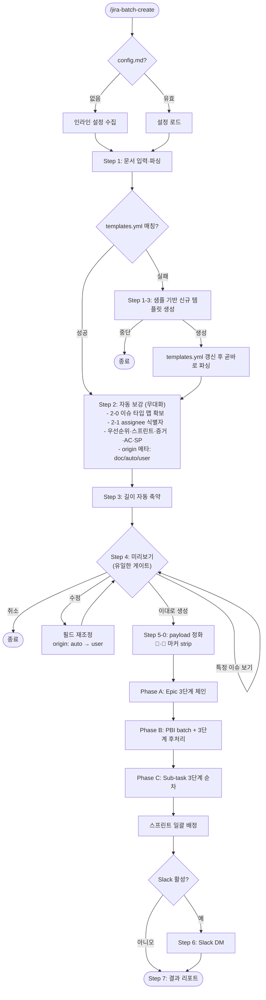

# jira-create 스킬

Jira 이슈를 AI 에이전트 대화 형식으로 생성하는 스킬이다. Claude Code와 Codex 양 환경을 지원한다.
Story (스토리) / Task (작업) / Bug (버그) / Spike (스파이크) / Sub-task (하위 작업)를 지원하며, 생성 후 Slack DM으로 알림을 전송한다.

---

## 목차

- [포함 파일](#포함-파일)
- [플로우](#플로우)
- [사전 준비](#사전-준비)
- [설치](#설치)
- [워크플로우](#워크플로우)
  - [초기 설정 (자동 수집)](#초기-설정-자동-수집)
  - [이슈 생성](#이슈-생성)
  - [SDD 템플릿 시스템](#sdd-템플릿-시스템)
  - [일괄 생성](#일괄-생성)
- [특정 이슈만 다른 프로젝트로 생성할 때](#특정-이슈만-다른-프로젝트로-생성할-때)
- [관련 문서](#관련-문서)

---

## 포함 파일

| 파일 | 커맨드 | 용도 |
|------|--------|------|
| `jira-create.md` | `/jira-create` | 이슈 생성 (config 자동 수집·재설정 진입점 겸함) |
| `jira-batch-templates.md` | `/jira-batch-templates` | SDD 파싱 템플릿 관리 (편집 진입점) |
| `jira-batch-create.md` | `/jira-batch-create` | SDD 기반 이슈 일괄 생성 |

> 별도의 setup 진입점은 두지 않는다. `/jira-create` 또는 `/jira-batch-create` 첫 실행 시 hub의 `0-1` 인라인 fallback이 프로젝트 키·보드·커스텀 필드·Slack을 자동 수집해 config 파일을 생성한다. 재설정은 `0-0c` 슬롯별 수정 흐름에서 수행한다.

---

## 플로우

> 초기 설정 다이어그램은 따로 두지 않는다. `/jira-create` 첫 실행이 곧 setup이며, 그 흐름은 [초기 설정 (자동 수집)](#초기-설정-자동-수집) 섹션의 단계별 설명을 참조한다.

### /jira-create


### /jira-batch-templates 플로우


> "수정" 분기는 기존 샘플 없이 규칙만 갱신하므로 샘플 SDD 입력을 거치지 않는다. 신규 추가일 때만 샘플 SDD 입력으로 진입한다.

### /jira-batch-create 플로우



---

## 사전 준비

### MCP 서버

아래 2개 MCP 서버가 각 환경에 등록되어 있어야 한다.

- `mcp-atlassian` (`uvx mcp-atlassian`) -- `JIRA_URL`, `JIRA_USERNAME`, `JIRA_API_TOKEN`
- `slack` (`npx @anthropic-ai/mcp-server-slack`) -- `SLACK_BOT_TOKEN`, `SLACK_TEAM_ID`

Slack Bot 필요 권한: `users:read`, `im:write`, `chat:write`

| 환경 | MCP 설정 위치 |
|------|-------------|
| Claude Code | `~/.claude/settings.json` |
| Codex | `~/.codex/config.toml` |

---

## 설치

`atlassian-skills` 저장소 루트에서 빌드 스크립트를 실행하면 각 환경에 자동 배포된다.

```bash
# 양 환경 동시 배포
bash scripts/build-skills.sh

# 특정 환경만
bash scripts/build-skills.sh --target claude
bash scripts/build-skills.sh --target codex

# 프로젝트 scope 배포 (테스트용)
bash scripts/build-skills.sh --scope project --project-dir <path>
```

| 환경 | 배포 경로 |
|------|---------|
| Claude Code | `~/.claude/commands/{jira-create,jira-batch-create,jira-batch-templates}.md` |
| Codex | `~/.agents/skills/{jira-create,jira-batch-create,jira-batch-templates}/SKILL.md` |

스킬은 환경별 설정 파일을 읽으므로 Jira 프로젝트가 다른 경우 각 프로젝트 디렉토리에서 `/jira-create`를 처음 실행하면 자동으로 그 환경의 config가 생성된다.

> 같은 config 파일은 `sprint/` 스킬 묶음(`/sprint-bootstrap`, `/sprint-sync`, `/sprint-close`)도 공유한다. `/jira-create` 첫 실행은 `## Jira` / `## 알림` 섹션만 작성하고 Notion 섹션은 작성하지 않는다. Notion 동기화가 필요하면 `/sprint-setup`을 실행해 `## Notion` 섹션을 incremental로 추가한다.

---

## 워크플로우

### 초기 설정 (자동 수집)

별도 setup 명령은 없다. `/jira-create`(또는 `/jira-batch-create`)를 처음 실행하면 hub의 `0-1` 인라인 fallback이 자동으로 모든 슬롯을 수집한 뒤 config 파일을 생성한다.

```
/jira-create [선택: 작업 설명]
```

config 파일이 없거나 값이 `YOUR_`로 시작하면 다음 순서로 진행한다:

1. **프로젝트 키 입력** -- `$ARGUMENTS`에 알파벳 2~10자가 있으면 그것을, 없으면 입력 요청
2. **보드 탐색** -- `jira_get_agile_boards`로 보드 목록 조회 (1개면 자동 확정, 2~4개 선택 UI, 5개 이상 이름 일부 입력으로 필터)
3. **커스텀 필드 자동 매핑** -- 슬롯마다 `jira_search_fields`를 영어/한국어 키워드로 1회씩 호출하여 후보를 dedupe로 모은다. 각 후보를 `[글로벌] / [{KEY} 정의]` 출처 라벨로 변환해 사용자에게 노출하고, 매칭 1개·2개 이상·0개 분기에 따라 확인 질문 또는 선택 UI 제시. 선택지에는 `사용 안 함` / `직접 입력 (customfield_12345 또는 검색 키워드)`가 항상 포함된다. 직접 입력은 `customfield_숫자` 형식이면 ID 검증, 그 외 텍스트면 키워드로 재검색해 후보 풀에 합집합 + dedupe.
4. **Slack 알림 설정** -- 사용 여부 확인 → 사용 시 표시 이름 입력으로 `slack_get_users` 자동 변환 → 매칭 실패 시 멤버 ID 직접 입력. "사용 안 함" 시 `(none)`
5. **설정 파일 저장** -- Claude: `~/.claude/sprint-workflow-config.md`, Codex: `~/.agents/sprint-workflow-config.md`

> 우선순위와 증거 형태는 더 이상 사용자에게 입력받지 않는다. 이슈 생성 시점에 task별 자동 추론으로 결정한다(spec-kit `[US?]`/`(Priority: P?)` → High/Medium/Low + epic 상속 + Medium fallback / 파일 경로·키워드 매칭으로 PR 링크·Confluence·스크린샷·로그 결정). 추론 규칙은 tmaxsoft Confluence DoD·Jira 작성 규칙 페이지 기반.

설정 결과 예시:
```
## Jira
프로젝트 키: TCI
보드 ID: 1092
스토리 포인트 필드: customfield_10016
AC 필드: customfield_11576
증거 필드: (none)

## 알림
Slack 사용자 ID: U12345678   # (none)이면 Slack 알림 비활성
```

> 설정 파일(`sprint-workflow-config.md`)은 개인 정보를 포함한다. **절대 git에 커밋하지 말 것.**
> `.gitignore`에 해당 파일 경로를 추가하라.

#### 재설정 / 부분 수정

기존 설정이 이미 있으면 매 호출 시 hub `0-0b`가 현재 설정을 보여주고 "그대로 진행 / 항목 수정"을 묻는다. "항목 수정" 선택 시 `0-0c`로 진입해 슬롯 단위 수정 가능 (프로젝트·보드, SP/AC/EV 필드, Slack). 프로젝트가 바뀌거나 필드 ID가 변경됐을 때도 같은 흐름으로 처리한다.

#### 1회성 다른 프로젝트 사용

config를 바꾸지 않고 한 번만 다른 프로젝트로 생성하려면 인수에 키를 같이 넘긴다 (`/jira-create MYPROJ`). 자세한 동작은 [특정 이슈만 다른 프로젝트로 생성할 때](#특정-이슈만-다른-프로젝트로-생성할-때) 섹션 참조.

---

### 이슈 생성

```
/jira-create [선택: 자유 형식 작업 설명]
예) /jira-create 인증 토큰 갱신 API 만들기, 만료 후 재로그인 불편 해소를 위해
```

에이전트가 단계별로 필드를 수집한다:

| Step | 수집 항목 |
|------|----------|
| 0 | config.md 로드 (프로젝트 키, 보드 ID, 커스텀 필드) |
| 1 | 이슈 유형 (Story / Task / Bug / Spike / Sub-task 이중 언어 선택) |
| 2 | 요약 / Epic 연결 / 스프린트 배정 / 부모 키(Sub-task) |
| 3 | 스토리 포인트 추천 및 확정 |
| 4 | Description 작성 |
| 5 | 미리보기 확인 |
| 6 | 이슈 생성 (`jira_create_issue` + `jira_update_issue`) |
| 7 | Slack DM 알림 |
| 8 | 결과 출력 |

#### config 미설정 시 동작

설정 파일(`sprint-workflow-config.md`)이 없거나 값이 `YOUR_`로 시작하면, Step 0의 `0-1` 인라인 fallback이 자동으로 모든 슬롯을 수집해 config 파일을 **신규 작성**한다. 다음 실행부터는 `0-0` config 로드 경로로 진입하며 매번 묻지 않는다. 자세한 단계는 [초기 설정 (자동 수집)](#초기-설정-자동-수집) 참조.

---

### SDD 템플릿 시스템

SDD(설계 문서) 파싱 규칙을 템플릿으로 정의하고, `jira-sdd-templates.yml`에 등록한다.

> **신규 등록은 `/jira-batch-create` 첫 실행 중 샘플 SDD를 기반으로 자동 처리된다.** `/jira-batch-create`이 입력 문서와 매칭되는 템플릿을 찾지 못하면, 같은 흐름 안에서 그 문서를 샘플로 신규 템플릿을 생성한 뒤 곧바로 파싱·생성으로 이어진다.
>
> `/jira-batch-templates`는 **이미 등록된 템플릿을 보정·삭제하거나, SDD 없이 직접 명시 등록·재정의**할 때 쓰는 편집 진입점이다.

```
/jira-batch-templates
```

1. 기존 등록된 템플릿 목록 확인 → 추가 / 수정 / 삭제 선택
2. **추가**: 이름 지정 → 샘플 SDD 입력 → 파싱 규칙 자동 생성 → 저장
3. **수정**: 템플릿 선택 → (기존 샘플 없이) 규칙 항목 수정 → 저장
4. **삭제**: 템플릿 선택 → 즉시 삭제

템플릿은 SDD의 구조(헤딩 레벨, 마커, 태그)를 Jira 이슈 타입으로 매핑한다:

| SDD 요소 | Jira 이슈 타입 |
|----------|---------------|
| 문서 제목 | Epic |
| User Story Phase | Story |
| 태그 있는 Task (`[USn]`) | Sub-task |
| 태그 없는 Task | Task (PBI) |

---

### 일괄 생성

```
/jira-batch-create [SDD 파일 경로]
예) /jira-batch-create ./specs/tasks.md
```

설계 문서를 단일 소스로 신뢰하고, 문서에 없는 필드는 자동 보강해 사용자 개입을 최종 미리보기 1회로 압축한다.

| Step | 내용 | 사용자 개입 |
|------|------|-----------|
| 1 | 문서 입력 + 템플릿 매칭·파싱 | 파일 경로 1회 (없을 때만) |
| 2 | 필드 자동 보강 (이슈 타입 맵·assignee·우선순위·증거 형태·스프린트·AC·SP). 우선순위·증거는 Confluence DoD/Jira 작성 규칙 기반 task별 추론 | 없음 |
| 3 | 콘텐츠 길이 자동 축약 | 없음 |
| 4 | 미리보기 + 확인 (생성/수정/특정 이슈 보기/취소) | **1회 기본** |
| 5 | Jira 이슈 생성 (payload 정화 → Phase A/B/C) | 없음 |
| 6 | Slack DM 알림 | 없음 |
| 7 | 결과 리포트 | 실패 시만 재시도 질문 |

**자동 보강 원칙**:
- `ISSUE_TYPE_MAP`: 프로젝트 이슈 샘플링으로 Epic/Story/Task/Sub-task 로컬라이즈 이름 1회 캐싱(한국어/영문 인스턴스 자동 대응)
- **assignee**: `jira_search(assignee = currentUser())` 응답에서 `id` / `email` / `display_name` 순으로 확보. 응답이 비면 `{ASSIGNEE} = null`로 두고 모든 Phase의 payload에서 `assignee` 키를 생략(unassigned fallback)
- 필드 출처(`origin`) 메타: `doc` / `auto` / `user` — 미리보기에서 🤖/👤 마커로 표시, **Jira payload에는 포함하지 않음** (Step 5-0에서 strip 검증)

**Phase 호출 체인** (세 Phase 모두 3단계 구조 통일):
- Phase A — Epic: `jira_create_issue` 빈 티켓 → 커스텀 필드·priority → description 단독
- Phase B — PBI: `jira_batch_create_issues` + validate_only 사전 검증 → 커스텀 필드·parent·priority → description 단독
- Phase C — Sub-task: `jira_create_issue` with parent → 커스텀 필드·priority → description 단독
- description이 항상 마지막 단독 호출인 이유: Jira Cloud ADF 검증이 description + 커스텀 필드 혼합 payload를 거절하며, parent 설정 시 자동화 룰이 description을 덮어쓸 수 있기 때문

---

## 특정 이슈만 다른 프로젝트로 생성할 때

config를 바꾸지 않고 한 번만 다른 프로젝트 키를 사용하려면:

```
/jira-create MYPROJ
```

`$ARGUMENTS`의 프로젝트 키가 config의 PROJECT_KEY보다 우선 적용된다.

---

## 관련 문서

- [고도화 로드맵 (`ROADMAP.md`)](ROADMAP.md) — 완료된 항목과 계획된 기능(이슈 연결 / 단건 생성 템플릿 / 에러 복구), 우선순위 제안
